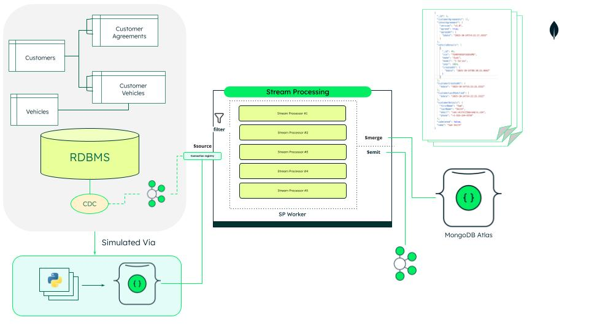

# Atlas Stream Processing Example

This repository demonstrates some of the Atlas Stream Processing (ASP) capabilities in [MongoDB Atlas](https://cloud.mongoDB.com).

The demo will simulate a scenario depicted in the diagram below but for simplicity, the source data and its simulated change will be driven from a MongoDB collection:


The source data represents customers and their relationships with vehicels and agreements (e.g. a system for car dealerships that need to capture customer interest in vehicles as well as capturing agreements that have been accepted - e.g. privacy agreements).

The end result should be a de-normalised version of the data model held in a mongoDB collection. 

### Features

As part of this demo, you will see how the aggregation piplines in ASP can be used to ingest and transform the data in real time.

Stream processors are created to "join" the results into a target collection without having to perform explicit lookups where possible using the [`$merge`](https://www.mongodb.com/docs/atlas/atlas-stream-processing/sp-agg-merge/) stage - thereby creating the de-normalised target model or a continuously refereshed materialised view.

In scenarios where you do need to perform a lookup (e.g. for enrichment via reference data) we use stages like [`$cachedLookup`](https://www.mongodb.com/docs/atlas/atlas-stream-processing/sp-agg-cachedlookup/) to make this more performant.

Additionally, the demo will include stream processors that can publish the de-normalised data to a kafka broker incorporating a transformed model that includes details of the data before the changes were made. This processor will also explicitilly filter changes being streamed from the MongoDB collection based on the existence of certain fields.


## Prerequisites
- A MongoDB Atlas account with Atlas Stream Processing enabled.
- Basic knowledge of MongoDB and aggregation pipelines.
- Access to a Kafka broker (e.g. Confluent Cloud) if you want to test the Kafka publishing feature. 


## Getting Started

1. **Clone the repository:**
    ```bash
    git clone https://github.com/your-org/ASPDemo.git
    cd ASPDemo
    ```

2. **Create an Atlas Cluster and configure a Streams Processing Instance**

See [this link](https://www.mongodb.com/products/platform/cloud) to create your Atlas cluster and [this link](https://www.mongodb.com/docs/atlas/atlas-stream-processing/quickstart/) for instructions on how to create a streams processing instance in Atlas.

Ensure you have configured database users and network access so that you can connect to your cluster and streams processing instance from your laptop.


3. **Add Connections to the Stream Processing Connection Registry and Deploy Processors**

Once the stream processing instance is up and running, add a connection to your conenction registry for the Atlas cluster on which this demo will run.
Optionally also add the connection for you kafka broker.

Note for the Sink Processors in this demo I've created two connections in the registry:
- "AtlasDatabase" - for my source and destination MongoDB Atlas clusters
- "Confluent" - for my target kafka sink

If you create connections with different names, make sure you modify the stream processor files accordingly.

Make sure you have [mongosh](https://www.mongodb.com/docs/mongodb-shell/) installed and have updated the connection details in the [mongodb.properties](./streamProcessors/mongodb.properties) file accordingly.

To install all the stream processors, run the ```load_all_stream_processors.sh``` script.

If you want to re-deploy the configuration of a single stream proessor you can use the following command:

    mongosh mongodb://<username>:<password>@<atlas-stream-processor-connection>/ --tls --file <fileName>

## Run the Demo

To run the demo, navigate to the ```dataLoaders``` directory and set the ```MONGODB_URI``` to your MongoDB Atlas cluster in the [config.ini](./dataLoaders/config.ini) file.

The demo itself will leverage the python scripts in this directory to simulate the data being received via a kafka broker as part of a CDC pipeline. Each file represents the changes (or additions to) a source table.

First ensure that you have python installed and that you can installed the ```pymongo``` library:

    pip install -r requirements.txt

Then run the [create_vehicles.py](./dataLoaders/create_vehicles.py) file to load the vehicle information that will be used as reference data (by default it will create 1000 vehicles).

    python3 create_vehicles.py

Once this is loaded you can load any of the other scripts to simulate the data coming into the system. The purpose of this demo is to show how the changes are aggregated into the target collection so the scripts have been written to drop each collection before inserting 10 records. This will make it easier to see the changes taking place in the target collections (and the kafka topics).

You can run the [create_customerVehicles.py](./dataLoaders/create_customerVehicles.py) and [create_customerAgreements.py](./dataLoaders/create_customerAgreements.py) scripts multiple times to show how the new records are being added to the target arrays rather than replacing them.

**Note**: It does make sense to load the customers first but you can load the data in any order as the stream processing piplines simply merge the records into the target collection correlating on the ```customerID``` field.

### Verifying the Results

As you run each of the scripts, open up [MongoDB Compass](https://www.mongodb.com/products/tools/compass) and monitor the target collection. You should see the customer details being enriched as each script is run. Additionally, if you have also configured the kaka connection then you should also see the messages being sent to the kafka topic.

